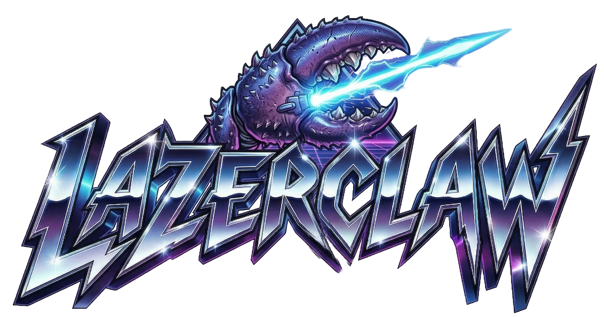

<p align="center">
  
</p>

<h3 align="center">The World's First & Only Heavy Metal Design Tool Made for Lobsters™</h3>

<p align="center">
  A free, browser-based graphic design application — create logos, posters, album covers, and more.
  <br />
  No account needed. Just click "Use as Guest" and start shredding.
</p>

<p align="center">
  <a href="https://lazerclaw.com">Live Demo</a> · <a href="#features">Features</a> · <a href="#getting-started">Get Started</a> · <a href="LICENSE">License</a>
</p>

---

## Features

### Design Tools
- **Canvas Editor** — Fabric.js-powered vector/raster editor with drag-and-drop
- **Shapes & Vectors** — Rectangles, circles, stars, arrows, polygons, and more
- **Text Tool** — 50+ fonts, curved text, vertical text, letter spacing, text overflow control
- **Pen Tool** — Full Bézier path editor with sub-tools (rectangle, ellipse, polygon, line, arc, spiral)
- **Blob Brush** — Freehand vector drawing with automatic blob merging
- **Clipart Library** — 40,000+ images across 40+ categories
- **Layer Management** — Full layer panel with drag reorder, visibility, locking, and groups
- **Masking** — Vector masks with clip paths
- **Tiling** — Grid, half-brick, half-drop, and mirror repeat patterns
- **Color Picker** — Solid, gradient, image fill, and pattern modes

### AI-Powered
- **Drunk Robot Lobster** — AI design assistant chatbot (powered by Anthropic Claude) that can add shapes, text, images, and modify your canvas by voice command
- **Text-to-Image** — Generate images from text prompts via Nano Banana API
- **Image Editing** — Edit images with text descriptions
- **Background Removal** — One-click AI background removal
- **Photo Restoration** — Restore old or damaged photos
- **Colorization** — Add color to black & white photos
- **Red-Eye Removal** — Automatic red-eye correction

### Media & Export
- **Motion** — Add video clips and animated GIFs to canvas
- **Audio** — Add background audio tracks with waveform timeline
- **Export** — PNG, PDF, MP4 video, and design package (.zip)
- **Printer Marks** — Bleed, trim, safe area guides with crop marks and registration marks

### UI/UX
- **Dark Mode** — Toggle with smooth view-transition animation
- **Keyboard Shortcuts** — Full set of shortcuts for power users
- **Responsive Toolbar** — Collapses intelligently at narrow widths
- **Lightning Intro** — Heavy metal-themed entrance animation with sound effects

## Tech Stack

| Layer | Technology |
|-------|-----------|
| **Frontend** | React 18, Vite, Tailwind CSS, Fabric.js |
| **Backend** | Vercel Serverless Functions |
| **Auth** | JWT (jose) + bcrypt + IP allowlisting |
| **AI Chat** | Anthropic Claude API |
| **AI Images** | Nano Banana API |
| **Storage** | AWS S3 (clipart, patterns, motion, audio assets) |

## Getting Started

### Prerequisites

- Node.js 18+
- npm

### Setup

1. **Clone the repository:**
   ```bash
   git clone https://github.com/petehottelet/lazerclaw.git
   cd lazerclaw
   ```

2. **Install dependencies:**
   ```bash
   npm install
   ```

3. **Create your environment file:**
   ```bash
   cp .env.example .env
   ```

4. **Configure environment variables** (see `.env.example` for all options):

   | Variable | Required | Description |
   |----------|----------|-------------|
   | `JWT_SECRET` | Yes | Random string for signing auth tokens (`openssl rand -hex 32`) |
   | `ADMIN_EMAIL` | Yes | Admin login email |
   | `ADMIN_PASSWORD_HASH` | Yes | bcrypt hash of admin password |
   | `ANTHROPIC_API_KEY` | For AI chat | Anthropic API key for Dr. Claw assistant |
   | `NANO_BANANA_API_KEY` | For AI images | Nano Banana API key for image generation |
   | `VITE_S3_BUCKET` | For assets | S3 bucket name for clipart/media hosting |
   | `AWS_ACCESS_KEY_ID` | For assets | AWS credentials for S3 uploads |

5. **Generate an admin password hash:**
   ```bash
   node -e "import('bcryptjs').then(b => b.hash('your-password', 10).then(console.log))"
   ```

6. **Start the dev server:**
   ```bash
   npm run dev
   ```

### Deploy to Vercel

```bash
npm i -g vercel
vercel
# Set environment variables in Vercel project settings
vercel --prod
```

## Project Structure

```
├── api/                    Vercel serverless API routes
│   ├── auth/               Login, logout, user management, IP auth
│   ├── agent.js            AI chat assistant (Claude) endpoint
│   └── ai-image.js         AI image generation endpoint
├── src/
│   ├── main.jsx            Entry point: intro, welcome page, routing
│   ├── App.jsx             Main editor layout and keyboard shortcuts
│   ├── index.css           Tailwind + animations + effects
│   ├── components/
│   │   ├── CanvasArea.jsx  Fabric.js canvas with snapping, tools, rendering
│   │   ├── Toolbar.jsx     Top toolbar with all tool buttons
│   │   ├── AgentChat.jsx   Drunk Robot Lobster AI chatbot + animated gem
│   │   ├── ShapesPanel.jsx Shapes, vectors, clipart browser
│   │   ├── LayersPanel.jsx Layer management panel
│   │   └── ...             Other panels and UI components
│   ├── hooks/
│   │   └── useCanvasState.js  Central state management
│   └── utils/              Tiling, contour tracing, pen tool, AI APIs
├── public/                 Static assets (logos, audio, shapes)
├── scripts/                S3 upload and manifest build utilities
├── middleware.js            Vercel edge middleware (JWT auth)
├── .env.example            Environment variable template
└── vercel.json             SPA routing config
```

## Keyboard Shortcuts

| Shortcut | Action |
|----------|--------|
| `V` | Select tool |
| `B` | Blob brush |
| `P` | Pen tool |
| `Ctrl+C/X/V/D` | Copy / Cut / Paste / Duplicate |
| `Ctrl+Z` / `Ctrl+Shift+Z` | Undo / Redo |
| `Ctrl+G` / `Ctrl+Shift+G` | Group / Ungroup |
| `Ctrl+]` / `Ctrl+[` | Bring forward / Send backward |
| `Ctrl+=` / `Ctrl+-` | Zoom in / out |
| `Ctrl+0` | Fit to view |
| `Delete` | Delete selected |
| `Arrow keys` | Nudge 1px (Shift: 10px) |

## Contributing

Contributions are welcome. Please open an issue or pull request.

## License

This project is licensed under the [MIT License](LICENSE).
